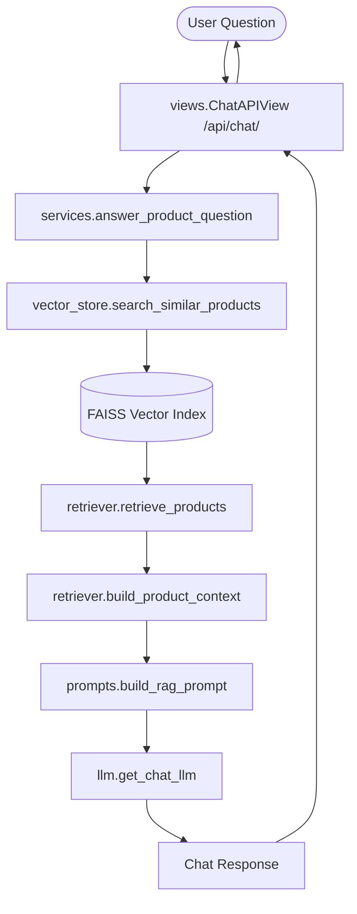

# Product Catalog RAG Chatbot

This module implements a production-ready **Retrieval-Augmented Generation (RAG)** chatbot that queries the Django product catalog database, performs semantic similarity searches, and answers user questions using LangChain and Google Gemini.

---

## 🏗️ Architecture Flow

The RAG pipeline operates as follows:



---

## 📋 Features

1. **Semantic Search with FAISS**: Stores product titles, categories, descriptions, price, availability, and user reviews as semantic vectors.
2. **Real-time DB-to-Vector Sync**: Automatically keeps the vector index updated via Django Database Signals when products or reviews are created, modified, or deleted.
3. **Offline Fallback / Mock Mode**: If `GEMINI_API_KEY` is not provided in `.env`, the system automatically falls back to:
   - **`FakeEmbeddings`**: Generates mock vectors to allow FAISS indexing and similarity search.
   - **`MockChatGemini`**: A context-aware mock chat LLM that parses retrieved product blocks from the prompt context and answers user queries deterministically.
   - *This prevents 500 server errors and allows developers to run and test the catalog search system completely offline out-of-the-box.*

---

## 🔑 Environment Configuration

Add the following settings to your local `.env` file:

```env
# RAG Chatbot Settings
GEMINI_API_KEY=your-gemini-api-key-here   # Leave blank to run in mock mode
CHAT_MODEL=gemini-2.5-flash
EMBEDDING_MODEL=gemini-embedding-001
FAISS_INDEX_PATH=                         # Leave blank to use defaults (BASE_DIR/faiss_db)
```

---

## 🛠️ Management Commands

We provide Django management commands to build and refresh embeddings:

### 1. Build Embeddings
Builds the FAISS database index from scratch using all active products:
```bash
python manage.py build_embeddings
```

### 2. Update Embeddings
Refreshes the embeddings in FAISS for any new or modified active products:
```bash
python manage.py update_embeddings
```

---

## 📂 Project Structure

```
rag/
├── management/
│   └── commands/
│       ├── build_embeddings.py   # Rebuilds the FAISS index
│       └── update_embeddings.py  # Refreshes catalog embeddings
├── apps.py                       # App config, registers signal handlers
├── embeddings.py                 # Normalizes product catalog into text docs
├── llm.py                        # Handles ChatGoogleGenerativeAI & MockChatGemini
├── models.py                     # Database schemas for persisted embeddings
├── prompts.py                    # Strict system prompts template
├── retriever.py                  # Integrates FAISS results into LangChain format
├── services.py                   # Coordinates query -> retrieval -> LLM -> reply
├── signals.py                    # Django Signals (post_save/post_delete on Product/Review)
├── urls.py                       # Routing for frontend chatbot page and REST API
└── views.py                      # CBVs for the chatbot page and POST chat endpoint
```

---

## 🚀 Running and Testing

1. **Activate Virtual Env & Run Server**:
   ```bash
   .venv\Scripts\activate
   python manage.py runserver
   ```
2. **Launch the Chat Interface**:
   Open http://localhost:8000/chatbot/ in your browser.
3. **Submit a Query**:
   - Ask: `"Gaming laptop under ₹80,000"` or `"Wireless Headphones"`.
   - The chatbot will automatically return the matching items, their prices, and their stock availability directly from your database.
